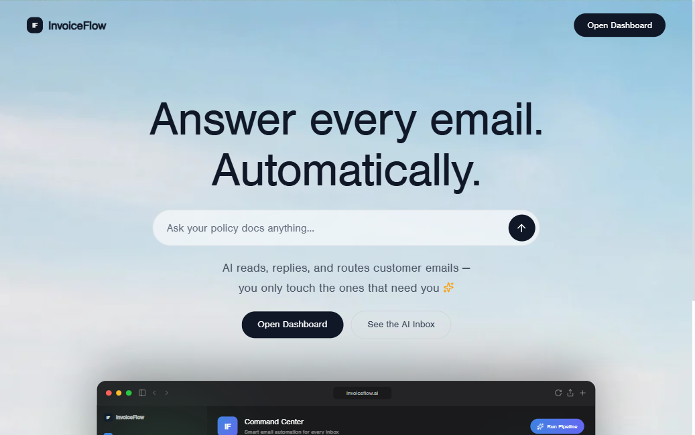

<div align="center">

# InvoiceFlow

### AI-Powered Email Automation for Customer Support

[](https://python.org)
[](https://fastapi.tiangolo.com)
[](https://react.dev)
[](https://langchain-ai.github.io/langgraph)
[](https://ai.google.dev)
[](LICENSE)

**InvoiceFlow** reads your Gmail inbox, understands each email, drafts context-aware replies using your own business documents, and either auto-sends safe responses or queues sensitive ones for human review — all without touching a single email manually.

[**Live Demo**](https://invoiceflow.vercel.app) · [**Setup Guide**](#-quick-start) · [**Deploy Your Own**](#-deployment)

</div>

---

## Screenshots

<table>
<tr>
<td><p align="center"><em>Landing page</em></p></td>
<td><p align="center"><em>Command Center (light)</em></p></td>
</tr>
<tr>
<td><p align="center"><em>Dark mode</em></p></td>
<td><p align="center"><em>Analytics dashboard</em></p></td>
</tr>
<tr>
<td><p align="center"><em>AI Inbox — threaded view</em></p></td>
<td><p align="center"><em>Human review queue</em></p></td>
</tr>
</table>

---

## What it does

Most businesses spend hours every day answering the same customer questions. InvoiceFlow automates that loop:

1. **Reads** — Fetches unanswered Gmail threads from the last 8 hours
2. **Understands** — Classifies each email (product enquiry / complaint / feedback / unrelated) and detects sentiment
3. **Retrieves** — For product questions, searches your uploaded business documents (PDFs, TXT, DOCX) via RAG
4. **Writes** — Drafts a contextual, on-brand reply using Gemini Flash 2.0
5. **Proofreads** — Self-checks the draft; rewrites up to 3× if it fails quality checks
6. **Decides** — Auto-sends safe replies; queues anything sensitive (refunds, legal, account deletion) for your approval
7. **Learns** — Logs every interaction to a searchable history with analytics

---

## Features

| Feature | Details |
|---|---|
| **LangGraph state machine** | Deterministic pipeline: inbox → categorise → RAG → write → proofread → send/draft |
| **RAG over your docs** | Upload PDFs / TXT / DOCX; Chroma + HuggingFace embeddings answer product questions |
| **Smart send mode** | Sensitive keywords trigger human review automatically |
| **React dashboard** | Real-time stats, threaded inbox, review queue, analytics charts |
| **Policy Chat** | Multi-turn RAG chat over your documents — ask anything about your business |
| **Light & dark mode** | Animated sky background, glassmorphism cards, smooth transitions |
| **Multi-user auth** | Google OAuth login — each user has their own Gmail + isolated data |
| **One-click deploy** | Render (backend) + Vercel (frontend), fully guided |

---

## Architecture

```
Gmail Inbox
    │
    ▼
load_inbox_emails ──(empty)──► END
    │
    ▼
categorize_email → analyze_sentiment
    │
    ├─ product_enquiry ──► construct_rag_queries → retrieve_from_rag ──► email_writer
    ├─ complaint/feedback ────────────────────────────────────────────► email_writer
    └─ unrelated ──► skip_unrelated_email ──► (next email)
                                                      │
                                              email_proofreader
                                                /    |    \
                                           send  rewrite  stop
                                            │       │
                                      send_email  email_writer
                                            │    (max 3 retries)
                                            ▼
                                      back to inbox loop
```

**Stack:**
- **Orchestration** — LangGraph `StateGraph` (`src/graph.py`)
- **LLM** — Gemini 2.0 Flash via `langchain-google-genai` (`src/agents.py`)
- **Vector store** — Chroma + HuggingFace `all-MiniLM-L6-v2` embeddings (`db_local/`)
- **Gmail** — Google API Python Client with OAuth 2.0 (`src/tools/GmailTools.py`)
- **Backend** — FastAPI (`app_server.py`) on port 5000
- **Frontend** — React 19 + Vite + Tailwind CSS 4 + Recharts (`frontend/`)
- **Auth** — Google OAuth 2.0 + JWT (`src/auth_service.py`)

---

## Quick Start

### Prerequisites

- Python 3.10+
- Node.js 18+
- A Google account with Gmail
- A [Google Gemini API key](https://aistudio.google.com/app/apikey) (free tier)

### 1 — Clone & set up Python

```bash
git clone https://github.com/sarcasticpanda/Invoice_automation.git
cd Invoice_automation

python -m venv venv
# Windows:
venv\Scripts\activate
# macOS/Linux:
source venv/bin/activate

pip install -r requirements.txt
```

### 2 — Configure environment

```bash
cp .env.example .env
```

Edit `.env`:
```env
MY_EMAIL=your-gmail@gmail.com
GOOGLE_API_KEY=AIza...          # Gemini API key
GROQ_API_KEY=gsk_...            # Optional — for Policy Chat RAG
```

### 3 — Gmail OAuth (first run only)

```bash
python main.py
```

A browser tab opens for Google consent. After you approve, `token.json` is created and all future runs are silent.

### 4 — Build the vector store

Upload your business documents (PDFs, TXTs) to the `data/` folder, then:

```bash
python populate_db_local.py
```

### 5 — Start the backend

```bash
python app_server.py
```

### 6 — Start the frontend

```bash
cd frontend
npm install
npm run dev
```

Open **[http://localhost:3000](http://localhost:3000)** — the dashboard is live.

---

## Running the pipeline

```bash
# Smart mode (default) — auto-send safe, queue sensitive
python main.py

# Auto-send everything
python main.py --auto-send

# Queue everything for human review (safe for testing)
python main.py --no-auto-send
```

Or hit **Run Once** in the dashboard.

---

## Deployment

> Deploy the frontend free on Vercel and the backend on Render. Multi-user Google OAuth lets anyone sign in with their own Gmail and API key.

### Step 1 — Google Cloud Console

1. Go to [console.cloud.google.com](https://console.cloud.google.com) → your project
2. **APIs & Services → Credentials → + Create → OAuth 2.0 Client ID**
3. Type: **Web application**
4. Authorized redirect URIs:
   - `http://localhost:5000/api/auth/callback`
   - `https://your-backend.onrender.com/api/auth/callback`
5. Save the **Client ID** and **Client Secret**

### Step 2 — Deploy backend to Render

1. [render.com](https://render.com) → New Web Service → connect your repo
2. Build: `pip install -r requirements.txt`
3. Start: `uvicorn app_server:app --host 0.0.0.0 --port $PORT`
4. Add a **Disk** (1 GB, mount `/opt/render/project/src`)
5. Environment variables:

   | Key | Value |
   |---|---|
   | `SKIP_AUTH` | `false` |
   | `SECRET_KEY` | *(click Generate)* |
   | `GOOGLE_CLIENT_ID` | from Step 1 |
   | `GOOGLE_CLIENT_SECRET` | from Step 1 |
   | `BACKEND_URL` | `https://your-app.onrender.com` |
   | `FRONTEND_URL` | `https://your-app.vercel.app` |

### Step 3 — Deploy frontend to Vercel

1. [vercel.com](https://vercel.com) → Import repo → root dir: `frontend`
2. Environment variables:

   | Key | Value |
   |---|---|
   | `VITE_API_URL` | `https://your-backend.onrender.com` |
   | `VITE_SKIP_AUTH` | `false` |

3. Deploy → share the URL!

### Cost

| Service | Free tier |
|---|---|
| Vercel (frontend) | Free forever |
| Render (backend) | Free (sleeps after 15 min) |
| Gemini Flash 2.0 | ~1,500 req/day free — covers ~50 emails/day |
| Groq (Policy Chat) | 14,400 req/day free |
| **Total for users** | **$0** |

---

## Project Structure

```
invoice_automation/
├── app_server.py          # FastAPI backend (port 5000)
├── main.py                # Pipeline CLI entry point
├── populate_db_local.py   # Build vector store from data/
├── render.yaml            # Render deployment config
│
├── src/
│   ├── graph.py           # LangGraph StateGraph definition
│   ├── nodes.py           # One method per graph node
│   ├── agents.py          # LangChain chains (prompt | LLM | output)
│   ├── prompts.py         # All prompt templates
│   ├── state.py           # GraphState TypedDict + Email model
│   ├── structure_outputs.py  # Pydantic schemas for structured output
│   ├── history_store.py   # Email history R/W + analytics
│   ├── auth_service.py    # JWT + per-user data helpers
│   ├── chat_service.py    # Multi-turn RAG chat sessions
│   └── tools/
│       └── GmailTools.py  # Gmail API: fetch, send, draft
│
├── frontend/
│   ├── src/
│   │   ├── App.tsx             # Routes + auth guards
│   │   ├── context/
│   │   │   ├── AuthContext.tsx # JWT auth state
│   │   │   └── ThemeContext.tsx# Light/dark theme
│   │   ├── components/
│   │   │   └── Layout.tsx      # Sidebar + animated background
│   │   └── pages/
│   │       ├── Landing.tsx     # Marketing landing page
│   │       ├── Login.tsx       # Google Sign-In
│   │       ├── Setup.tsx       # First-time API key entry
│   │       ├── Dashboard.tsx   # Command center + pipeline trigger
│   │       ├── Threads.tsx     # Threaded AI inbox
│   │       ├── ReviewQueue.tsx # Human approval queue
│   │       ├── Analytics.tsx   # Charts + sentiment analysis
│   │       ├── History.tsx     # Contact intelligence hub
│   │       ├── Documents.tsx   # Knowledge base management
│   │       └── Chat.tsx        # Policy assistant (RAG chat)
│   └── vite.config.ts
│
├── data/                  # Your business documents (gitignored)
├── docs/screenshots/      # Project screenshots
└── .env.example           # Environment variable template
```

---

## Environment Variables

```env
# Required
MY_EMAIL=your-gmail@gmail.com
GOOGLE_API_KEY=AIza...          # Google Gemini API key

# Optional
GROQ_API_KEY=gsk_...            # For Policy Chat RAG queries

# Production only (set in Render dashboard)
SKIP_AUTH=false
SECRET_KEY=...                  # Auto-generated by Render
GOOGLE_CLIENT_ID=...
GOOGLE_CLIENT_SECRET=...
FRONTEND_URL=https://your-app.vercel.app
BACKEND_URL=https://your-api.onrender.com
```

---

## Tech Stack

| Layer | Technology |
|---|---|
| AI Orchestration | LangGraph 1.1 |
| LLM | Google Gemini 2.0 Flash |
| RAG | LangChain + Chroma + HuggingFace Embeddings |
| Email | Gmail API (google-auth-oauthlib) |
| Backend | FastAPI + Uvicorn |
| Frontend | React 19 + Vite + TypeScript |
| Styling | Tailwind CSS 4 + CSS custom properties |
| Charts | Recharts |
| Animation | Motion (Framer Motion) |
| Auth | Google OAuth 2.0 + PyJWT |

---

## Contributing

Pull requests welcome. For major changes, open an issue first.

```bash
# Run backend
python app_server.py

# Run frontend (hot reload)
cd frontend && npm run dev

# TypeScript check
cd frontend && npx tsc --noEmit
```

---

## License

MIT © 2026 [Sarcastic Panda](https://github.com/sarcasticpanda)

---

<div align="center">
Built with LangGraph · Gemini · React · FastAPI
</div>
