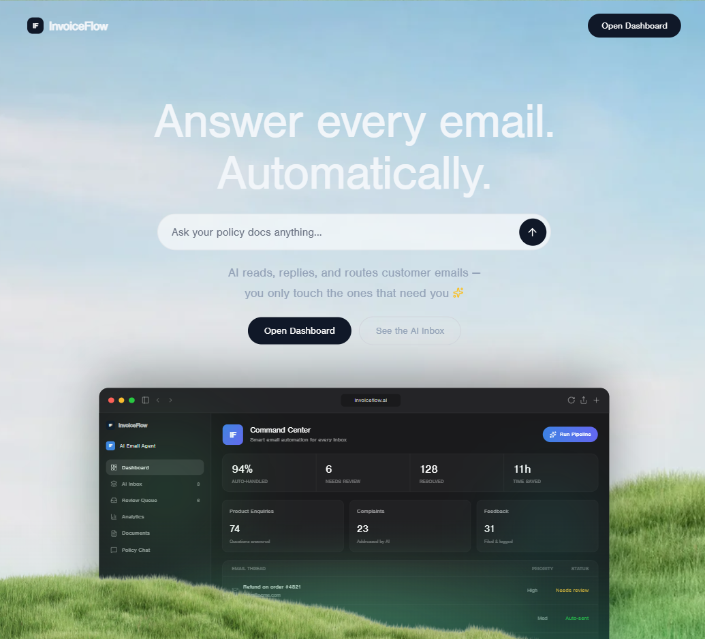
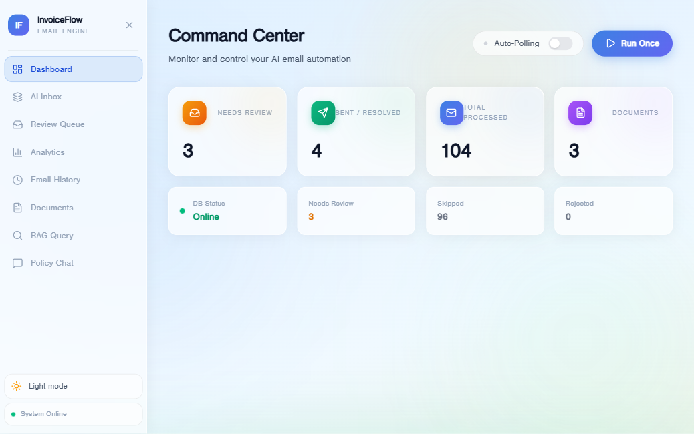
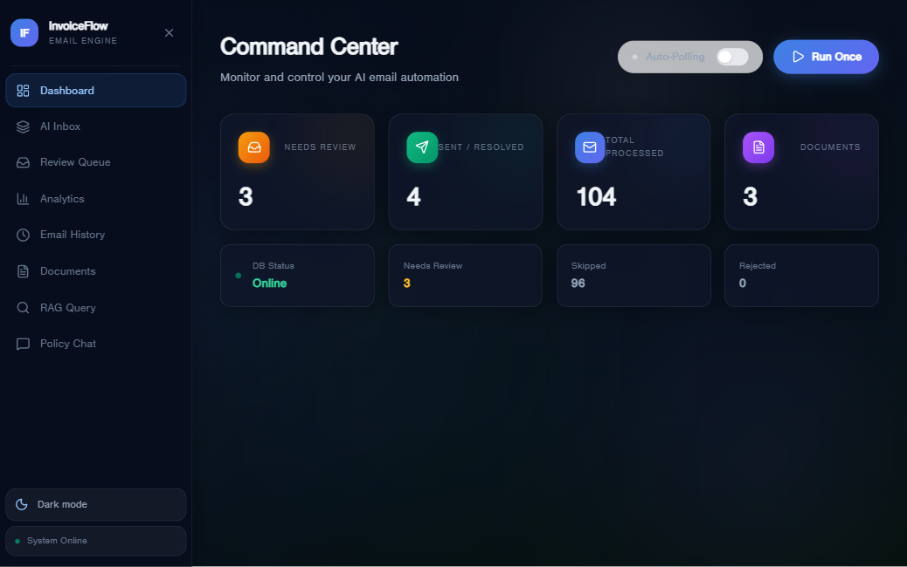
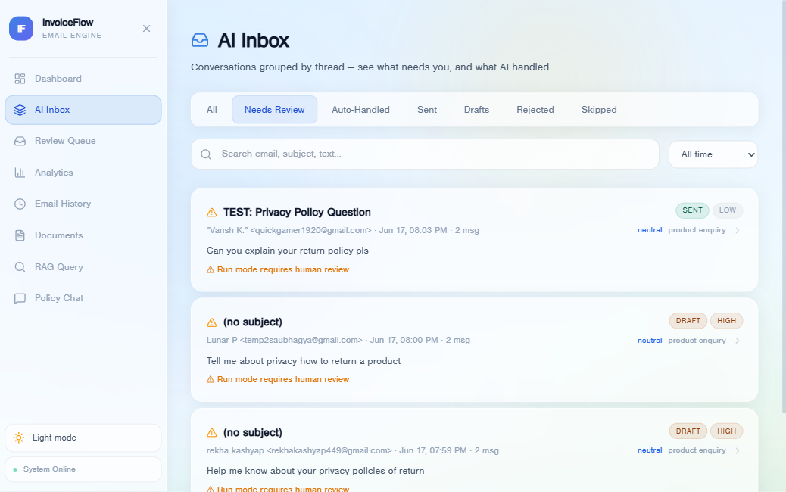
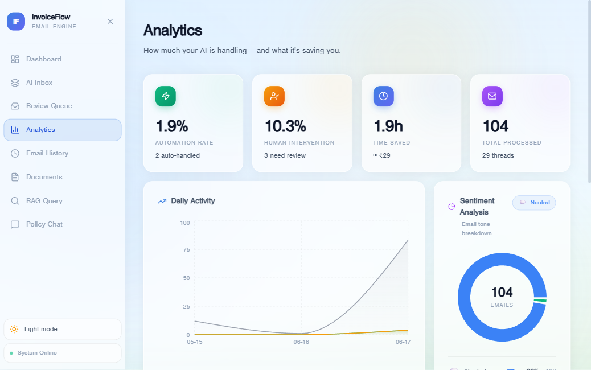
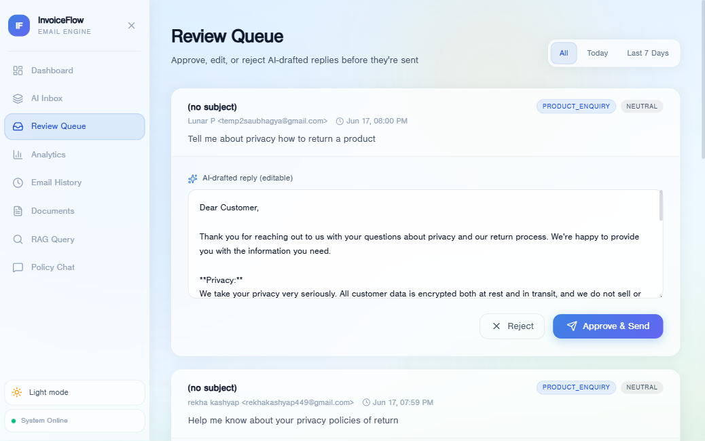
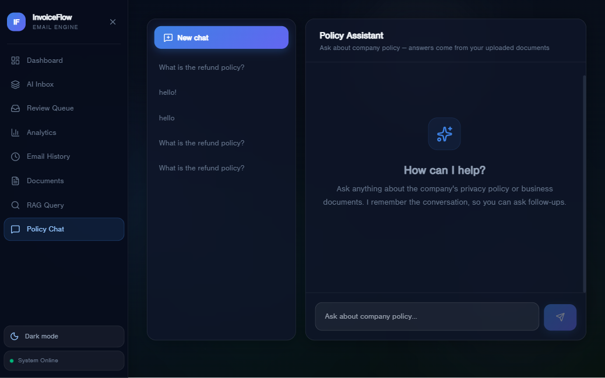

<div align="center">

# InvoiceFlow

### AI-Powered Email Automation for Customer Support

[](https://python.org)
[](https://fastapi.tiangolo.com)
[](https://react.dev)
[](https://langchain-ai.github.io/langgraph)
[](https://ai.google.dev)
[](https://www.trychroma.com)

</div>

---



---

## About

**InvoiceFlow** automates customer email replies using AI. It reads your Gmail inbox, understands what each customer needs, searches your business documents for answers, drafts contextual replies, self-corrects them, and sends safe ones automatically — or queues sensitive ones for your approval. Built on LangGraph for a deterministic, fully auditable pipeline you can trust.

---

## See It In Action

<table>
<tr>
<td width="50%"><p align="center"><em><strong>Command Center</strong><br/>One click to process inbox</em></p></td>
<td width="50%"><p align="center"><em><strong>Dark Mode</strong><br/>Glassmorphism design</em></p></td>
</tr>
<tr>
<td><p align="center"><em><strong>AI Inbox</strong><br/>Threaded conversations</em></p></td>
<td><p align="center"><em><strong>Analytics</strong><br/>Sentiment & automation trends</em></p></td>
</tr>
<tr>
<td><p align="center"><em><strong>Human Review</strong><br/>Edit & approve drafts</em></p></td>
<td><p align="center"><em><strong>Policy Chat</strong><br/>RAG Q&A over your docs</em></p></td>
</tr>
</table>

---

## Features at a Glance

| Feature | What it Does |
|---|---|
| **Automated Email Processing** | Reads Gmail inbox, categorizes, drafts, and sends replies (or queues them) |
| **RAG-Powered Replies** | Grounds responses in your business documents, not generic LLM knowledge |
| **Self-Correcting Writer** | AI drafts reply → proofreader checks it → if needed, writer revises (up to 3 retries) |
| **Smart Auto-Send** | Safe replies sent automatically; sensitive ones (refunds, legal, etc.) queue for approval |
| **Threaded Inbox View** | All emails grouped by conversation with status, priority, sentiment |
| **Human Review Queue** | Edit, approve, or reject any AI draft before it goes to the customer |
| **Analytics Dashboard** | Automation rate, time saved, category breakdown, sentiment trends |
| **Contact Intelligence** | Per-contact history and sentiment analysis |
| **Policy Chat** | Multi-turn RAG chat — ask questions about your business documents |
| **Knowledge Base** | Upload/manage PDFs, TXTs, DOCXs from the dashboard |
| **Light & Dark Mode** | Glassmorphism UI with animated background |
| **Multi-User Auth** | Google OAuth login; each user has isolated data |

---

## How It Works

InvoiceFlow processes each email through a **directed graph**. Every decision point uses structured LLM output to route to the next node.

```
                           GMAIL INBOX (last 8 hours)
                                    │
                                    ▼
                            Load Unanswered Threads
                                    │
                         ┌──────────┴──────────┐
                         │                     │
                    Empty?                 No: Process
                         │                     │
                      END                      ▼
                                         Categorize Email
                                         (4 categories)
                                                 │
                                                 ▼
                                          Analyze Sentiment
                                                 │
                    ┌────────────────────┬──────┴──────┬─────────────────┐
                    │                    │             │                 │
            Product Enquiry         Complaint      Feedback         Unrelated
                    │                    │             │                 │
                    ▼                    │             │                 ▼
           Construct RAG Queries         │             │            Skip Email
                    │                    │             │             (next)
                    ▼                    │             │
            Retrieve from Chroma         │             │
            (top-k relevant chunks)      │             │
                    │                    │             │
                    └────────────────────┴──────┬──────┘
                                                 │
                                                 ▼
                                           Draft Reply
                                        (using context)
                                                 │
                                                 ▼
                                          Proofread Draft
                                                 │
                    ┌────────────────┬──────────┴──────────┬──────────────┐
                    │                │                     │              │
               Sendable          Not Sendable         No Confidence     Failed
                    │                │                     │              │
                    ▼                ▼                     ▼              ▼
                 SEND          Get Feedback         Queue for Review   Give Up
                    │          & Retry (max 3)            │            (flag)
                    │                │                     │              │
                    └────────────────┴─────────────────────┴──────────────┘
                                     │
                              Back to Inbox
                              (next thread)
```

**Every email flows through this graph. No email is processed the same way twice.**

---

## Processing Pipeline: Step by Step

### 1. **Categorization**
The LLM classifies each email into one of four categories:
- **Product Enquiry** — questions about products, pricing, policies, or procedures
- **Complaint** — customer expressing dissatisfaction or reporting issues
- **Feedback** — suggestions, praise, or general comments
- **Unrelated** — spam, off-topic, or already resolved threads

### 2. **Sentiment Analysis**
Detects emotional tone: positive, neutral, negative, or urgent. Negative/urgent emails are flagged for human review even if auto-send is enabled.

### 3. **Conditional RAG Retrieval** *(Product Enquiries Only)*
- LLM generates 2–3 targeted search queries from the email body
- Queries run against ChromaDB (your document vector store)
- Top-k results returned and concatenated as context
- Context passed to email writer for grounded responses

### 4. **Email Writer**
Drafts a reply using:
- Original email + customer context
- Retrieved document chunks (if applicable)
- Prior draft + proofreader feedback history (on retries)

### 5. **Email Proofreader**
Checks the draft for:
- Tone appropriateness (not defensive, not too casual)
- Accuracy (doesn't contradict your docs)
- Completeness (answers the customer's question)
- Returns: `sendable: bool` + `feedback: str`

### 6. **Self-Correction Loop**
If proofreader says `sendable = False`:
- Feedback is appended to `writer_messages`
- Writer revises using that feedback
- Proofreader re-evaluates
- Up to **3 retries**, then gives up and flags for human review

### 7. **Send or Draft**
- **Auto-send mode**: Sends directly via Gmail API
- **Draft mode**: Saves as Gmail draft for human approval
- **Review mode**: Queues in Human Review Queue dashboard

---

## Email Handling: The Details

### Product Enquiries (with RAG)
When a customer asks about your products or policies, InvoiceFlow:
1. Generates specific search queries from the email body
2. Retrieves relevant chunks from your ChromaDB (your uploaded PDFs/docs)
3. Passes those chunks to the email writer as context
4. Result: responses grounded in **your actual business knowledge**, not generic LLM answers

### Complaints & Feedback (skips RAG)
These bypass document lookup (no need for retrieval) and go straight to the writer. The sentiment analysis flags them as negative/urgent, lowering the auto-send threshold — they're more likely to get queued for human review.

### Unrelated Emails (skipped)
Spam, off-topic, or resolved threads are silently skipped without generating any reply.

### Smart Auto-Send Guard
A separate **sensitive keyword detector** checks for terms like:
- `refund`, `chargeback`, `billing issue`
- `cancel`, `delete account`, `unsubscribe`
- `legal`, `lawsuit`, `GDPR`, `privacy`

Any email containing these is **always queued for review**, regardless of category or confidence.

---

## RAG System

### Vector Store: ChromaDB
- **Local persistent database** — no external APIs for retrieval
- **Metadata tagging** — each chunk stores source filename and position
- **Semantic search** — similarity search returns top-k most relevant chunks
- **Path**: `db_local/`

### Embeddings: HuggingFace all-MiniLM-L6-v2
- **Dimension**: 384-dimensional vectors
- **Model size**: ~90 MB, runs locally on startup
- **No API calls needed** — embeddings computed on your machine
- **Perfect for business documents** — semantic understanding of domain-specific language

### Document Processing Pipeline
1. Upload PDF / TXT / DOCX via dashboard
2. Extract raw text (PyPDF for PDFs, python-docx for DOCX)
3. Split into chunks: 500 characters, 50-character overlap
4. Embed with HuggingFace model
5. Store in ChromaDB with source metadata
6. **Immediately available** for RAG queries

---

## LLM Layer

### Primary: Google Gemini 2.0 Flash
`langchain-google-genai` integration. Fast, cost-effective, and supports **structured output** (JSON schemas).

### Fallback Chain
If Gemini is unavailable:
1. **OpenRouter** (`meta-llama/llama-3.3-70b-instruct:free`)
2. **Groq** (`llama-3.3-70b-versatile`)

### Structured Output
All LLM calls use Pydantic schemas with `with_structured_output`:

| Schema | Output |
|---|---|
| `EmailCategory` | `category: Literal["product_enquiry", "complaint", "feedback", "unrelated"]` |
| `SentimentResult` | `sentiment`, `confidence: float`, `summary: str` |
| `RAGQueries` | `queries: list[str]` |
| `WriterResult` | `reply: str` |
| `ProofreaderResult` | `sendable: bool`, `feedback: str` |

**Guaranteed JSON responses** → **deterministic routing** → **no parsing errors**.

---

## Tech Stack

| Component | Technology |
|---|---|
| **Orchestration** | LangGraph 1.1 — directed state graph |
| **LLM** | Google Gemini 2.0 Flash (+ OpenRouter/Groq fallback) |
| **Vector Store** | ChromaDB (local, persistent) |
| **Embeddings** | HuggingFace `all-MiniLM-L6-v2` (384-dim) |
| **Email** | Gmail API (`google-auth-oauthlib`) |
| **Backend** | FastAPI + Uvicorn |
| **Frontend** | React 19 + Vite + TypeScript |
| **Styling** | Tailwind CSS 4 + CSS variables |
| **Charts** | Recharts |
| **Animation** | Motion (Framer Motion) |
| **Auth** | Google OAuth 2.0 + PyJWT |

---

## Project Structure

```
invoice_automation/
├── app_server.py          # FastAPI backend
├── main.py                # Pipeline CLI entry
├── populate_db_local.py   # Build vector store
│
├── src/
│   ├── graph.py           # LangGraph state machine
│   ├── nodes.py           # Pipeline nodes
│   ├── agents.py          # LangChain chains (LLM integration)
│   ├── prompts.py         # Prompt templates
│   ├── state.py           # GraphState + Email model
│   ├── structure_outputs.py  # Pydantic schemas
│   ├── history_store.py   # History persistence
│   ├── auth_service.py    # Multi-user auth
│   ├── llm.py             # LLM provider + fallback
│   └── tools/GmailTools.py # Gmail API integration
│
├── frontend/              # React dashboard
│   ├── src/pages/        # 10 dashboard pages
│   ├── src/context/      # Auth + Theme context
│   └── src/components/   # Layout + shared UI
│
├── data/                  # Your business documents (gitignored)
├── db_local/              # ChromaDB vector store (gitignored)
├── docs/
│   ├── ARCHITECTURE.md    # Developer reference
│   └── screenshots/       # UI screenshots
└── README.md              # This file
```

---

## Quick Start

```bash
# 1. Clone and setup
git clone https://github.com/sarcasticpanda/Invoice_automation.git
cd Invoice_automation
python -m venv venv && venv\Scripts\activate
pip install -r requirements.txt

# 2. Configure
cp .env.example .env
# Edit .env: MY_EMAIL, GOOGLE_API_KEY (Gemini), GROQ_API_KEY

# 3. Gmail OAuth (opens browser once)
python main.py

# 4. Build vector store
python populate_db_local.py

# 5. Run
python app_server.py       # Backend (port 5000)
cd frontend && npm run dev  # Frontend (port 3000)
```

**Run modes:**
```bash
python main.py                # Smart: auto-send safe, queue risky
python main.py --auto-send    # Send all
python main.py --no-auto-send # Queue all for review
```

---

## License

MIT © 2026 [Sarcastic Panda](https://github.com/sarcasticpanda)

